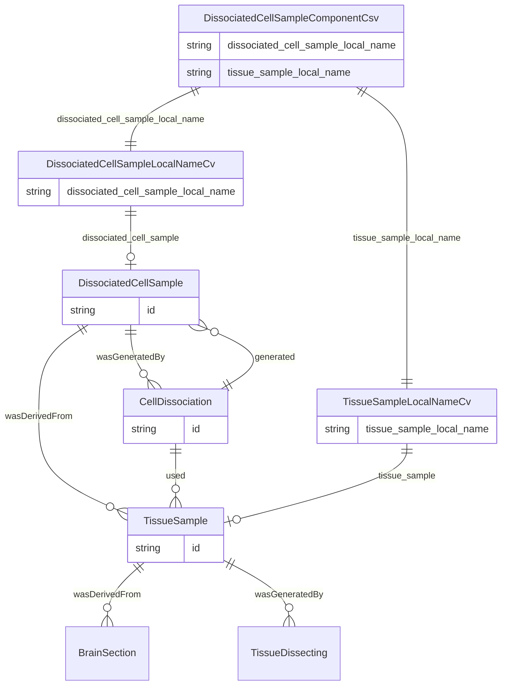

#### Populating Ontology-oriented LinkML from Schema-oriented LinkML tables.

The LinkML models used for defining the schemas of data tables (i.e. CSV or XLSX tables) is different from that used to model normalized entities. This document covers practices and tools that can be used to translate tabular data from a schema-oriented model to an ontology-oriented form.



#### Schema Models

These models specify data tables. This demo focuses on human-readable labels. Others can be IDs or measurement values, though.

The enriched\_cell\_sample\_component.csv table, for example relates an enriched cell sample local name to a tissue sample local name.

````
  enriched_cell_sample_component_csv:
    description: schema for enriched_cell_sample_component.csv
    slots:
      - enriched_cell_sample_local_name
      - dissociated_cell_sample_local_name

  dissociated_cell_sample_component_csv:
    description: schema for dissociated_cell_sample_component.csv
    slots:
      - dissociated_cell_sample_local_name
      - tissue_sample_local_name
````

dissociated\_cell\_sample\_component.csv:

| dissociated\_cell\_sample\_local\_name |tissue\_sample\_id |
| -------------------------- | ---------------- |
| 20231011_H23.30.001.BS.04.Pn.08.Multiome | H23.30.001.BS.04.Pn.08_Pn |
| ....| .... |

#### Controlled Vocabulary Models

Many of the columns that are in a data CSV are human-readable labels. Often the corresponding ID is maintained in a different table. We are able to model this label-ID correspondence using a simple two-slot LinkML model.

Generally one slot corresponds to the `id` slot of the LinkML models for entities. The other slot can be thought of as the `label` slot of an entity, although this pattern can also be used to model synonym vocabularies. The label slots are also used in the schema models. In this way controlled vocabulary models provide a mapping between data tables models and entity models.

In terms of OBO Foundry ontologies these slots also correspond to the properties `has representation` from the OBI ontology and `is about` from the IAO ontology, so they can be thought of as centrally registered identifiers (CRIDs).

````
classes:

  dissociated_cell_sample_local_name_cv:
    description: dissociated cell sample local names controlled vocabulary
    slots:
      - dissociated_cell_sample_local_name
      - dissociated_cell_sample

slots:

    dissociated_cell_sample_local_name:
        slot_uri: OBI:0002815  # has representation
        range: string

    dissociated_cell_sample:
        slot_uri: IAO:0000136  # is about
        range: dissociated cell sample
````

#### Entity Models

These models document the associations that each entity has to other entities. The slot ranges are generally other entity models, not literals as is the case with schema-oriented models.

````
classes:

  cell dissociation:
    description: >-
      A process that takes a tissue sample and produces a dissociated cell sample.
    is_a: activity
    mixins: 
      - prov activity
    slot_usage:
      used:
        range: tissue sample
      generated:
        range: dissociated cell sample
````

For RDF graph serialization in particular it is usually possible to create graph fragments separately and then trivially merge them at a later time. For this to work with RDF, entity IDs must be propagated to local contexts and blank nodes should be avoided.

### Graph Generation from Data Tables

Using a combination of schema-oriented models, controlled vocabulary models, ontology models and framents it is possible to take data tables, augment them with entity IDs and generate ontology-compliant graphs.

#### 1. Augment Data Tables with IDs

The first step is to look up the IDs that go along with the human readable labels and add them to the table. This example uses mock IDs, but the IDs can be cached from external source or defined in a previously ingested controlled vocabulary data table.

| cell\_dissociation\_process\_id | dissociated\_cell\_sample\_id | dissociated\_cell\_sample\_local\_name | tissue\_sample\_id |tissue\_sample\_local\_name |
| ---------------------------- | -------------------------- | ---------------- | -------------------------- | ---------------- |
| dissociation\_of\_H23.30.001.BS.04.Pn.08_Pn | S0WRJUJUPHG8PAQ3HAY | 20231011_H23.30.001.BS.04.Pn.08.Multiome | 63C6LXJJ52E8RMV8JVH |H23.30.001.BS.04.Pn.08_Pn |

#### 2. Serialize Using Column/Slot Subsets

The table with labels and IDs can then be sent to other systems. This stage is configured using the entity models. 

Exporting the table through the LinkML RDF generator takes a few simple operations:

- add URI prefixes to IDs
- select a subset and alias to match the model slots
- export as YAML


with IRI prefixes:

| cell\_dissociation\_process\_id | dissociated\_cell\_sample\_id | dissociated\_cell\_sample\_local\_name | tissue\_sample\_id |tissue\_sample\_local\_name |
| ---------------------------- | -------------------------- | ---------------- | -------------------------- | ---------------- |
| aiod:ex\_dissociation\_of\_H23.30.001.BS.04.Pn.08_Pn | aiod:cell\_S0WRJUJUPHG8PAQ3HAY | 20231011_H23.30.001.BS.04.Pn.08.Multiome | aiod:tissue\_63C6LXJJ52E8RMV8JVH |H23.30.001.BS.04.Pn.08_Pn |

subset and alias:

| id | generated | used |
| ---------------------------- | -------------------------- | ---------------- | 
| aiod:ex\_dissociation\_of\_H23.30.001.BS.04.Pn.08_Pn | aiod:cell\_S0WRJUJUPHG8PAQ3HAY | aiod:tissue\_63C6LXJJ52E8RMV8JVH |

YAML:

````
- id: aiod:ex_dissociation_of_H23.30.001.BS.04.Pn.08_Pn
  used:
  - aiod:tissue_63C6LXJJ52E8RMV8JVH
  generated:
  - aiod:cell_S0WRJUJUPHG8PAQ3HAY
````

##### ontology model fragment for RDF generation:

The data and the related model can then be passed to the LinkML `gen-rdf` command to generate RDF/TTL.  These steps are repeated for each model that is represented in the data table.

````
  cell dissociation:
    description: A process that takes a tissue sample and produces a dissociated cell
      sample.
    slots:
      - id
    slot_usage:
      used:
        range: tissue sample
      generated:
        range: dissociated cell sample

````

##### Generated RDF

````
aiod:ex_dissociation_of_H23.30.001.BS.04.Pn.08_Pn
    a bican:CellDissociation ;
    prov:generated aiod:cell_S0WRJUJUPHG8PAQ3HAY ;
    prov:used aiod:tissue_63C6LXJJ52E8RMV8JVH .
````

#### Additional configuration:

Data Table Columns (to generate schema models) :

````
dissociated_cell_sample_component:
  cell dissociation: 
      id: cell_dissociation_local_name_is_about
      used: tissue_sample_local_name_is_about
      generated: dissociated_cell_sample_local_name_is_about
  dissociated cell sample:
      id: dissociated_cell_sample_local_name_is_about
      label: dissociated_cell_sample_local_name
      wasGeneratedBy: cell_dissociation_local_name_is_about
      wasDerivedFrom: tissue_sample_local_name_is_about
  tissue sample:
      id: tissue_sample_local_name_is_about
      label: tissue_sample_local_name
````

Controlled Vocabulary info (to generate vocabulary models):

````
entity_class,label
dissociated cell sample,dissociated_cell_sample_local_name
enriched cell sample,enriched_cell_sample_local_name
tissue sample,tissue_sample_local_name
amplified cdna,amplified_cdna_local_name
barcoded cell sample,barcoded_cell_sample_local_name
library,library_local_name
library pool,library_pool_local_name
cell dissociation,dissociated_cell_sample_local_name

````

Mapping column subsets to entity slots:

````
dissociated_cell_sample_component:

  cell dissociation: 
      id: cell_dissociation_local_name_is_about
      used: tissue_sample_local_name_is_about
      generated: dissociated_cell_sample_local_name_is_about
      
  dissociated cell sample:
      id: dissociated_cell_sample_local_name_is_about
      label: dissociated_cell_sample_local_name
      wasGeneratedBy: cell_dissociation_local_name_is_about
      wasDerivedFrom: tissue_sample_local_name_is_about
      
  tissue sample:
      id: tissue_sample_local_name_is_about
      label: tissue_sample_local_name
````


